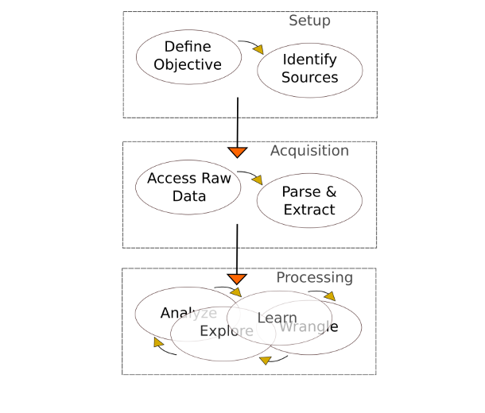
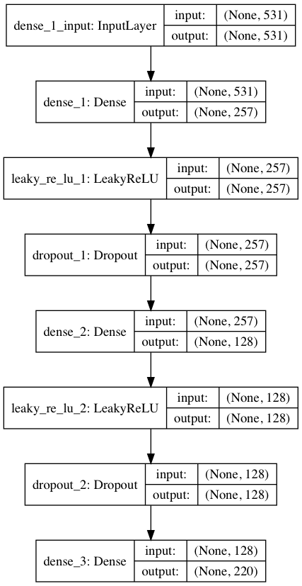

# 
Project COVID-19

## Contents:
- [File Description](#File-Description)
- [Introduction](#Introduction)
- [Pipeline Framework](#Pipeline-Framework)
   - [Setup Phase](#Setup-Phase)
   - [Acquisition Phase](#Acquisition-Phase)
   - [Processing Phase](#Processing-Phase)
- [Problem Statement](#Problem-Statement)
- [Solution to the Problem: Project COVID-19](#Solution-to-the-Problem-Project-COVID-19)
- [Dataset Description](#Dataset-Description)
- [Building the Chatbot Using DNN](#Building-the-Chatbot)
- [Chatbot Benchmarking](#Chatbot-Benchmarking) 
- [Chatbot Performance](#Chatbot-Performance) 
- [Challenges](#Challenges) 
- [Next Steps](#Next-Steps)
- [References](#References)

## File Description

- **COVID-19 Chatbot.ipynb**: contains data parsing and chatbot building process. **This is the main file**.
- **Twitter and FAQs Scraping.ipynb**: contains the data scraping process of the MOH and MOI's twitter accounts and the MOH's FAQs webpage.
- **TrackCorona_API Scraping.ipynb**: contains the data scraping process of the TrackCorona website.
- **SaudiMOI_MOH.csv**: contains scraped tweets.
- **moh_qna.csv**: contains scraped MOH's FAQs.
- **scraped_new.txt**: contains scraped TrackCorona figures.
- **Images Folder**: contains the images used thoughout the capstone.

# Introduction

 COVID-19 is “a newly discovered coronavirus that infects humans and whose [rapid] spread has [led] to a global pandemic with zero available therapeutic strategies” (Mamoor, 2020, p. 5).

# Pipeline Framework

 In this project, the web scraping pipeline framework is employed to organize the working process (see Image 1). The framework is carried out in three phases: setup, acquisition, and processing. In the setup phase, a problem is defined, which is there is an urgent need for a platform to obtain accurate information and updates about COVID-19. The twitter account of Ministry of Health (MOH)and Ministry of Interior (MOI), as well as, the website of the MOH and TrackCorona will be used for this task. In the acquisition phase, data will be scraped, then parsed and extracted using the web scraping tools Beautiful Soup and Selenium. The purpose is to change the data into a usable format. In the processing phase, data will be processed in two main stages: data understating and data preparation. 

                               
                               Image 1: Scraping Pipeline Framework (source: edited image from Laetsch, 2020)

# Setup Phase
## Problem Statement
There is an urgent need for a platform from where accurate information and updates about COVID-19 can be obtained.

## Solution to the Problem: Project COVID-19
What is Project COVID-19?
- It is an initiative that builds an interactive COVID-19 chatbot which leverages AI and deep learning technologies.
- It uses information from official sources for chatbot training.

**Meet Bot, your COVID-19 chatbot!**

- Facilitates access to reliable information regarding the COVID-19 pandemic
- Provides accurate and updated local and international COVID-19 figures
- Reports the latest news on COVID-19
- Fights misinformation 

Bot updates in hourly to accommodate the daily, weekly, or hourly updates published by LiveCorona, WHO, MOH, or MOI.

# Acquisition Phase
## Web Scraping
### 
<strong><em> Quest for COVID-19 Data</strong>

 In this phase, data will be extracted from the twitter account of Ministry of Health (MOH) and Ministry of Interior (MOI), as well as, the website of the MOH and TrackCorona. Then, the raw data were transformed into structured data for further analysis. These sources were chosen because they provide accurate COVID-19 information and updates from official sources. Note, TrackCorona is sponsored by Google Maps and Wikipidia and provides accurate COVID-19 information and updates from official sources.

# Processing Phase
## Data Understanding
### 
<strong><em> The Good, the Bad and the Value</strong>

 In this phase, there are three main stages: data understating, where the data will be examined for its quality, quantity, and usefulness, among other things. Data preparation stage, which is concerned with cleaning and preparing data for analysis; and data analysis stage, when data will be analyzed and visualized.

## Dataset Description
The datasets for this project are gathered from four different sources (see Table 1):

- **MOH tweets**: contain latest English MOH tweets related to COVID-19 (Twitter account: @SaudiMOH).
- **MOI tweets**: contain latest English MOI tweets related to COVID-19 (Twitter account: @MOISaudiArabia).
- **MOH FAQs**: contain latest English FAQs related to COVID-19 from MOH website (https://www.moh.gov.sa/en/CCC/FAQs/Corona/Pages/default.aspx).
- **TrackCorona**: contains latest local and internation COVID-19 figures by country from TrackCorona website (https://www.trackcorona.live).

Note: all the data was combined and used for modeling.

# Building the Chatbot
## Step 1. Collecting the Data

 The COVID-19 chatbot will be built in five steps (see Image 2). The first step is collecting data and cleaning the data for preprocessing (see Table 1). Step one was carried out in three different notebooks titled as 'TrackCorona_API Scraping', 'Twitter and FAQs Scraping', and 'Parsing_COVID19 Complete Data'. For more infrmation on the step one, please see the listed files in this repository. The second setp is preprocessing the data, the third step is creating the training data, the fourth step is modeling, and the fifth and last step is interacting with the chatbot though GUI. 

                                                 
                                                            Image 2: Steps for Building Bot

                                                                
                                                                Table 1: Data Size

## Step 2. Preprocessing the Data

In this step, the data was preprocessed using tokenization and stemming. Then, intents, classes and documents were created (see Diagram 1). 

                                                   
                                                   Diagram 1: Preprocessing the Data

## Step 3. Creating the Training Data

1.	Converting input patterns into numbers by 
  - Creating a list of zeroes equal to the length of the total number of words
  - Setting a value of 1 only to indexes that contain the word in the patterns
2.	Creating the output by setting 1 to the class input to which the pattern belongs

## Step 4. Training the Model
### Deep Neural Network Model

1.	The sequential neural network consists of three dense layers:
   - First layer (256 neurons)
   - Hidden layer (128 neurons) 
   - Last layer (the number of neurons is similar to the number of classes) 
2.	Overfitting was reduced by adding dropout layers 
3.	Stochastic gradient descent (SGD) optimizer and data fitting were used to train the model
   - Performs a parameter update for each training 
   - Fast technique
   - Performs one update at a time
   - SGD is a parameter used to determine find most optimal model
4.	The Nestrov accelerated gradient was employed.
5.	After being trained for 200 epochs, the model was saved using the Keras model.save(“chatbot_model.h5”) function (Diagram 2).

                                                              
                                                       Diagram 2: DNN Layers

## Step 5. Interacting With the Chatbot

The chatbot was programmed to predict the class to which a pattern belongs in order to retrieve an answer that matches a query. 

## Model Performance

                                                   
                                                           Model Performance

## Chatbot Benchmarking

                                                   
                                                           Chatbot Benchmarking
## Chatbot Performance 
### 
<strong><em> The chatbot metrics are in their early stages of development, and few references for consultation are available.</strong>

### Interactions per User
### 
<strong><em> Measuring the interactions between users and the Bot</strong>
- The Bot was tested several times by different users. 
- Several technical errors were noted during the testing, and these errors have already been addressed.

### Retention and Goal Completion
### 
<strong><em> Repeat users and usage purposes</strong>
- Most users who tested Bot would engage with it daily (number of users: 2−6)
- Motivation behind using Bot is checking the latest COVID-19 information from MOH and MOI.

## Challenges
- Tuning the parameters (trial and error)
- Operating Bot on Jupyter Notebook is inconvenient
- Hourly updates must be monitored daily so that changes in the format of data sources (websites) are incorporated during data parsing.

## Next Steps: Future Work
- Deploy the model on a social media platform
- Add more features to the chatbot
- Include Arabic responses 

## References:

- 
 Laetsch, T., 2020. Web Scraping With Python, accessed on 19 Mar, 2020:(https://campus.datacamp.com/courses/web-scraping-with-python/introduction-to-html?ex=1).

- 
 Mamoor, S., 2020. FBXL8 is differentially expressed and transcriptionally induced in MERS coronavirus infection.

- 
 Navlani, A., 2019. Web Scraping With Python, accessed on 19 Mar, 2020:(https://www.datacamp.com/community/tutorials/text-analytics-beginners-nltk).

- 
 Neff, A., 2019. Web Scraping With Python, accessed on 19 Mar, 2020:(https://www.icmi.com/resources/2019/metrics-uncover-the-value-of-chatbots-within-customer-service).

- 
 Jassova, B., 2019. Web Scraping With Python, accessed on 19 Mar, 2020:(https://landbot.io/blog/chatbot-metrics-kpi/).

- 
 Thkaur, S. Build Your First Python Chatbot Project, accessed on 29 Mar, 2020: (https://dzone.com/articles/python-chatbot-project-build-your-first-python-pro).

