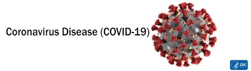

# 
Project COVID-19

# Introduction

 COVID-19 is “a newly discovered coronavirus that infects humans and whose [rapid] spread has [led] to a global pandemic with zero available therapeutic strategies” (Mamoor, 2020, p. 5).

## Problem Statement
There is an urgent need for a platform from where accurate information and updates about COVID-19 can be obtained.

## Solution to the Problem: Project COVID-19
What is Project COVID-19?
- It is an initiative that builds an interactive COVID-19 chatbot which leverages AI and deep learning technologies.
- It uses information from official sources for chatbot training.

## Dataset Description
The datasets for this project are gathered from four different sources (see Table 1):

- **MOH tweets**: contain latest English MOH tweets related to COVID-19 (Twitter account: @SaudiMOH).
- **MOI tweets**: contain latest English MOI tweets related to COVID-19 (Twitter account: @MOISaudiArabia).
- **MOH FAQs**: contain latest English FAQs related to COVID-19 from MOH website (https://www.moh.gov.sa/en/CCC/FAQs/Corona/Pages/default.aspx).
- **TrackCorona**: contains latest local and internation COVID-19 figures by country from TrackCorona website (https://www.trackcorona.live).

Note: all the data was combined and used for modeling.

## File Description
- **COVID-19 Chatbot.ipynb**: contains data parsing and chatbot building processes. This is the main file.
- **Twitter and FAQs Scraping.ipynb**: contains the data scraping processes for the MOH and MOI’s Twitter accounts and the MOH’s FAQs webpage.
- **TrackCorona_API Scraping.ipynb**: contains the data scraping process for the TrackCorona website.
- **SaudiMOI_MOH.csv**: contains the scraped tweets.
- **moh_qna.csv**: contains the scraped MOH’s FAQs.
- **scraped_new.txt**: contains the scraped TrackCorona figures.
- **Images Folder**: contains the images used thoughout the capstone.

## References:

- 
 Laetsch, T., 2020. Web Scraping With Python, accessed on 19 Mar, 2020:(https://campus.datacamp.com/courses/web-scraping-with-python/introduction-to-html?ex=1).

- 
 Mamoor, S., 2020. FBXL8 is differentially expressed and transcriptionally induced in MERS coronavirus infection.

- 
 Navlani, A., 2019. Web Scraping With Python, accessed on 19 Mar, 2020:(https://www.datacamp.com/community/tutorials/text-analytics-beginners-nltk).

- 
 Neff, A., 2019. Web Scraping With Python, accessed on 19 Mar, 2020:(https://www.icmi.com/resources/2019/metrics-uncover-the-value-of-chatbots-within-customer-service).

- 
 Jassova, B., 2019. Web Scraping With Python, accessed on 19 Mar, 2020:(https://landbot.io/blog/chatbot-metrics-kpi/).

- 
 Thkaur, S. Build Your First Python Chatbot Project, accessed on 29 Mar, 2020: (https://dzone.com/articles/python-chatbot-project-build-your-first-python-pro).

